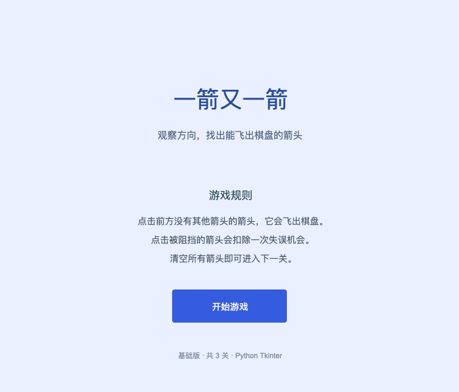
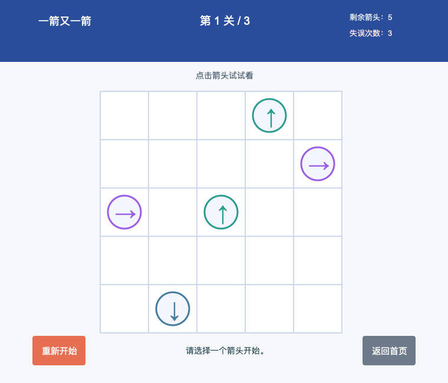
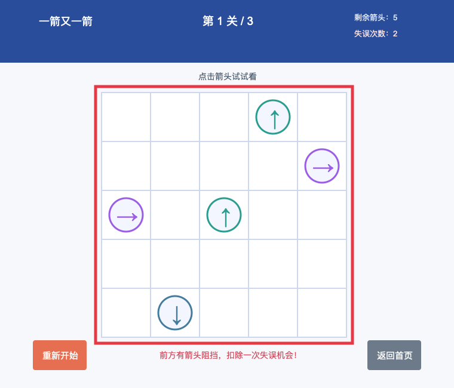
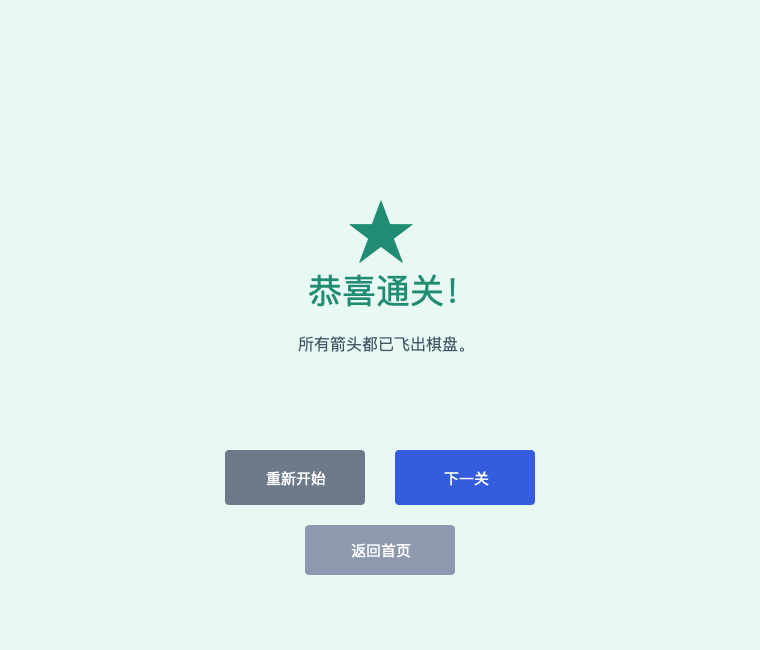

# 一箭又一箭（基础版）

一个使用 Python Tkinter 编写的点击式箭头解谜小游戏。本项目为福州大学 2026 秋《软件工程》第二次个人作业。

## 游戏简介

棋盘中有上、下、左、右四种方向的箭头。点击某个箭头后：

- 若它朝向棋盘边界的路径上没有其他箭头，它会飞出并消失；
- 若路径被其他箭头挡住，它不会消失，并扣除一次失误机会；
- 清除所有箭头即可进入下一关；失误次数用完则本关失败，可重新开始。

项目准备了 3 个经过试玩的可通关关卡，并包含开始界面、游戏界面、通关/失败界面和重新开始功能。

## 开发环境

- macOS / Windows / Linux
- Python 3.10 或更高版本
- Tkinter（Python 标准库，通常随 Python 一起安装）

本项目不依赖第三方库。

## 安装与运行

1. 克隆或下载本仓库。
2. 在项目根目录打开终端。
3. 执行：

```bash
python3 arrow_game.py
```

若 Windows 中 `python3` 不可用，可尝试：

```bash
python arrow_game.py
```

## 游戏操作

1. 在开始界面点击“开始游戏”。
2. 用鼠标点击棋盘中的箭头。
3. 优先点击前方没有箭头挡住的箭头。
4. 游戏中可随时点击“重新开始”恢复当前关卡。

## 自动化测试

核心路径检测的测试位于 `tests/test_board.py`，运行：

```bash
python3 -m unittest discover -s tests -v
```

## 游戏截图









## AIGC 说明

本项目开发中使用 Codex 辅助梳理界面结构、生成路径检测的初稿和设计自动化测试；代码经实际运行、手工试玩和测试后进行了调整。详细记录见课程作业博客。
